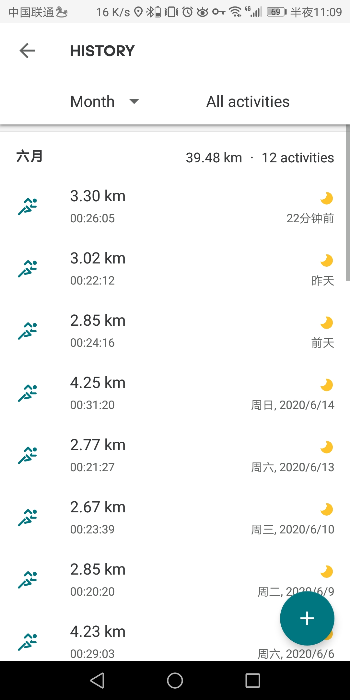

+++
title="当我跑步的时候我在想什么"
description="就是想记录下生活中的一些琐碎的细节"
date="2020-06-17"
categories=["人生","感悟"]
tags=["日记"]
+++

写在前面话

> 作为一个IT技术男本来搭建blog的第一件事本来应该是分享技术的
> 可是真的没办法技术太菜，只能先这样咸鱼凑个数吧。
> 可以先感受下我的菜 (今天有个测试小姐姐在问我如何写正则表达式在一陀文本中找出"想要找的字段"，
> 然后我想了想，从各个维度深度解析了下这不太好用正则表达式啥的。当我还沉浸在那种在游戏中吊打小学生的喜悦中时
> 小姐姐给我发截图过来了。。。。。 到现在我还觉得脸有点疼。)

# 当我跑步的时候我在想什么



跑步的习惯差不多一个半月了，坚持下去！

嗨，最近晚上一跑步就感觉思绪飞扬，天马行空，感觉自己都不是自己了，
然后跑完步准备刷道算法题，拿到题的时候还能思绪飞扬，然后看完解析，
就感觉自己是个zz，简直要自闭了。
每天这个情绪波动很是异常。
感觉还是有点抑郁症的意思啊。
这样其实有时候也挺好。
时而要上天，时而要下地狱
感觉跟过山车一样样！


```bash
#  最近的人生感悟是(记录下，或许可能真是很傻)：
#  人生会做出很多选择，不论选择最后的结果是不是自己设想的那样，我们都要坦然的去接受他，因为这些都是我们自己的选择。
#  人生可以做很多错误或者荒谬的选择，很多没有意义的事情，但是人生一定要过的有趣，有意义。
#  如果不能失败中吸取经验教训，那失败就是没有意义的。
#  乱世的繁华，每个人都有自己想要的生活，愿你们都安好！
```


